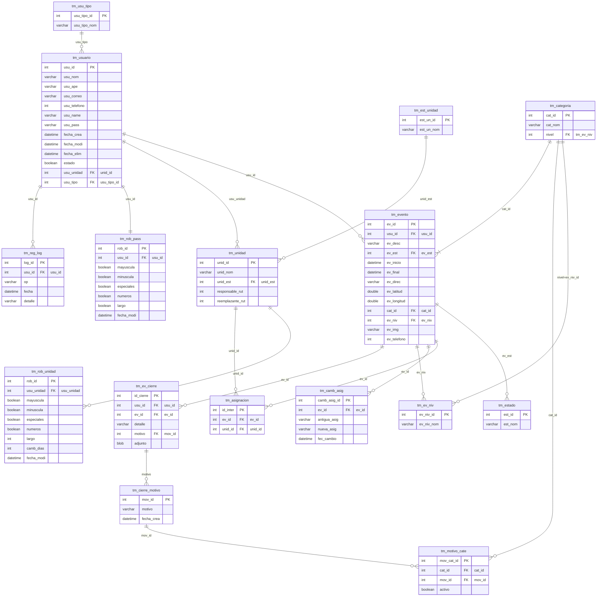

# modelo de base de dato

```mermaid

erDiagram

    tm_usuario {
        int usu_id PK
        varchar usu_nom
        varchar usu_ape
        varchar usu_correo
        int usu_telefono
        varchar usu_name
        varchar usu_pass
        datetime fecha_crea
        datetime fecha_modi
        datetime fecha_elim
        boolean estado
        int usu_unidad FK "unid_id"
        int usu_tipo FK "usu_tipo_id"
    }  
    tm_evento {
        int ev_id PK
        int usu_id FK "usu_id"
        varchar ev_desc
        int ev_est FK "ev_est"
        datetime ev_inicio
        datetime ev_final
        varchar ev_direc
        double ev_latitud
        double ev_longitud
        int cat_id FK "cat_id"
        int ev_niv FK "ev_niv"
        varchar ev_img
        int ev_telefono
    }
    tm_estado {
        int est_id PK
        varchar est_nom
    }
    tm_est_unidad {
        int est_un_id PK
        varchar est_un_nom
    }
    tm_unidad {
        int unid_id PK
        varchar unid_nom
        int unid_est FK "unid_est"
        int responsable_rut
        int reemplazante_rut
    }
    tm_rob_pass {
        int rob_id PK
        int usu_id FK "usu_id"
        boolean mayuscula
        boolean minuscula
        boolean especiales
        boolean numeros
        boolean largo
        datetime fecha_modi
    }
    tm_rob_unidad {
        int rob_id PK
        int usu_unidad FK "usu_unidad"
        boolean mayuscula
        boolean minuscula
        boolean especiales
        boolean numeros
        int largo
        int camb_dias
        datetime fecha_modi
    }
    tm_usu_tipo {
        int usu_tipo_id PK
        varchar usu_tipo_nom
    }
    tm_ev_cierre {
        int id_cierre PK
        int usu_id FK "usu_id"
        int ev_id FK "ev_id"
        varchar detalle
        int motivo FK "mov_id"
        blob adjunto
    }
    tm_ev_niv {
        int ev_niv_id PK
        varchar ev_niv_nom
    }
    tm_asignacion {
        int id_inter PK
        int ev_id FK "ev_id"
        int unid_id FK "unid_id"
    }
    tm_motivo_cate {
        int mov_cat_id PK
        int cat_id FK "cat_id"
        int mov_id FK "mov_id"
        boolean activo
    }
    tm_categoria {
        int cat_id PK
        varchar cat_nom
        int nivel FK "tm_ev_niv"
    }
    tm_cierre_motivo {
        int mov_id PK
        varchar motivo
        datetime fecha_crea
    }
    tm_reg_log {
        int log_id PK
        int usu_id FK "usu_id"
        varchar op
        datetime fecha
        varchar detalle
    }
    tm_camb_asig {
        int camb_asig_id PK
        int ev_id FK "ev_id"
        varchar antigua_asig
        varchar nueva_asig
        datetime fec_cambio
    }

    tm_usu_tipo ||--o{ tm_usuario : "usu_tipo"
    tm_usuario ||--o{ tm_evento : "usu_id"
    tm_usuario ||--o{ tm_unidad : "usu_unidad"
    tm_usuario ||--|| tm_rob_pass : "usu_id"
    tm_usuario ||--o{ tm_reg_log : "usu_id"
    tm_evento ||--o{ tm_estado : "ev_est"
    tm_est_unidad ||--o{ tm_unidad : "unid_est"
    tm_unidad ||--o{ tm_rob_unidad : "unid_id"
    tm_evento ||--o{ tm_asignacion : "ev_id"
    tm_unidad ||--o{ tm_asignacion : "unid_id"
    tm_categoria ||--o{ tm_ev_niv : "nivel=ev_niv_id"
    tm_categoria ||--o{ tm_motivo_cate : "cat_id"
    tm_evento ||--o{ tm_camb_asig : "ev_id"
    tm_evento ||--o{ tm_ev_niv : "ev_niv"
  
    tm_categoria ||--|{ tm_evento : "cat_id"
    tm_evento ||--o{ tm_ev_cierre : "ev_id"
    tm_ev_cierre ||--o{ tm_cierre_motivo : "motivo"
    tm_cierre_motivo ||--o{ tm_motivo_cate : "mov_id"
```

