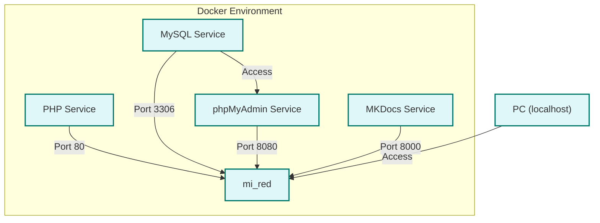

`docker-compose.yml` es un archivo de configuración para Docker Compose, una herramienta que permite definir y ejecutar aplicaciones Docker multicontenedor. En este archivo se especifican los servicios necesarios para la aplicación, cómo se construyen o ejecutan, y cómo se comunican entre ellos. Utiliza un formato YAML para definir los contenedores, redes y volúmenes necesarios para el entorno de desarrollo o producción.

## Servicios

### **Servicio PHP**

- **Imagen/Base**: Construido a partir de la imagen base `php:8-apache`.
- **Función**: Proporciona un servidor web Apache con PHP instalado para servir la aplicación web.
- **Puertos**: Mapea el puerto 80 del contenedor al puerto 80 del host, permitiendo el acceso a través de HTTP.
- **Volúmenes**: Mapea el directorio local `../../sistema_emergenciasV2` al directorio `/var/www/html` dentro del contenedor, lo que permite que el código fuente de la aplicación sea accesible para el servidor web.
- **Redes**: Conectado a la red personalizada `mi_red`, permitiendo la comunicación con otros contenedores en la misma red.

### **Servicio MySQL**

- **Imagen/Base**: Usa la imagen oficial de MySQL `mysql:8.4.0`.
- **Función**: Proporciona una base de datos MySQL para almacenar los datos de la aplicación.
- **Puertos**: Mapea el puerto 3306 del contenedor al puerto 3306 del host, permitiendo la conexión a la base de datos desde el exterior.
- **Variables de Entorno**:
     - `MYSQL_ROOT_PASSWORD`: Contraseña para el usuario root de MySQL.
     - `MYSQL_DATABASE`: Nombre de la base de datos inicial.
- **Volúmenes**: Mapea el archivo SQL `../../sistema_emergenciasV2/db_emergencia.sql` para inicializar la base de datos con datos predeterminados.
- **Redes**: Conectado a la red personalizada `mi_red`.

### **Servicio phpMyAdmin**

- **Imagen/Base**: Usa la imagen oficial `phpmyadmin/phpmyadmin`.
- **Función**: Proporciona una interfaz web para gestionar la base de datos MySQL.
- **Puertos**: Mapea el puerto 80 del contenedor al puerto 8080 del host, permitiendo el acceso a phpMyAdmin a través del navegador.
- **Variables de Entorno**:
     - `PMA_HOST`: Nombre del host de la base de datos (en este caso, `mysql`).
     - `PMA_USER`: Usuario para la conexión a la base de datos (root).
     - `PMA_PASSWORD`: Contraseña para el usuario (la misma que `MYSQL_ROOT_PASSWORD`).
- **Redes**: Conectado a la red personalizada `mi_red`.

### **Servicio MkDocs**

- **Imagen/Base**: Usa la imagen oficial `python:3.8`.
- **Función**: Proporciona un entorno para servir la documentación generada con MkDocs.
- **Volúmenes**: Mapea el directorio local `../../sistema_emergenciasV2/docs` al directorio `/docs` dentro del contenedor, permitiendo que los archivos de documentación sean accesibles.
- **Directorio de Trabajo**: Establece el directorio de trabajo como `/docs`.
- **Comando**: Instala las dependencias listadas en `requirements.txt` y luego ejecuta el servidor de MkDocs en el puerto 8000.
- **Puertos**: Mapea el puerto 8000 del contenedor al puerto 8000 del host, permitiendo el acceso a la documentación a través del navegador.
- **Redes**: Conectado a la red personalizada `mi_red`.

### **Redes**

- **mi_red**: Red personalizada que permite la comunicación entre todos los contenedores definidos en el archivo `docker-compose.yml`.

## Diagrama docker-compose

### Explicación del Diagrama

- **PHP (Apache + PHP 8)**: El servicio que sirve la aplicación web y está conectado a la base de datos MySQL. También interactúa con phpMyAdmin y MkDocs.
- **MySQL 8.4.0**: El servicio de base de datos que almacena la información de la aplicación.
- **phpMyAdmin**: Herramienta de administración de bases de datos que se conecta a MySQL para permitir la gestión de la base de datos a través de una interfaz web.
- **MKDocs (Python 3.8)**: Proporciona el entorno para servir la documentación de la aplicación, que está conectada a través de la red personalizada `mi_red`.

Cada servicio está conectado a la red `mi_red`, lo que permite la comunicación entre ellos. El diagrama muestra las conexiones y la relación entre los servicios en tu entorno Docker.
