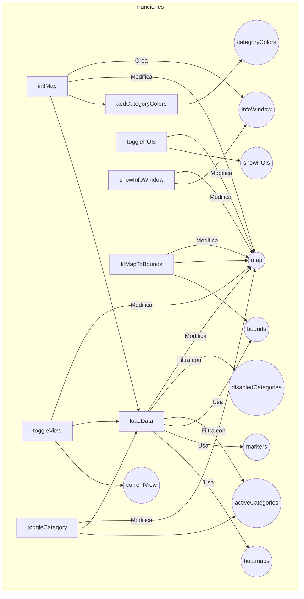
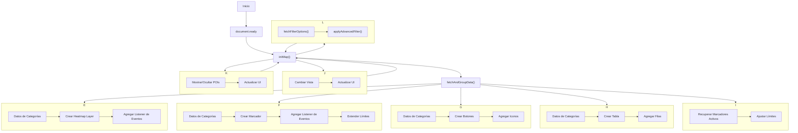
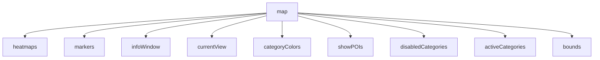

# requerimientos

## API o Librerías Necesarias

1. **Google Maps JavaScript API**
     - URL: `https://maps.googleapis.com/maps/api/js?key=YOUR_API_KEY&libraries=visualization&callback=initMap`

2. **Google Maps Visualization Library**
      - Incluida en la Google Maps JavaScript API.

3. **Select2**
      - URL: `https://cdn.jsdelivr.net/npm/select2@4.1.0-rc.0/dist/css/select2.min.css`
      - JS: `https://cdn.jsdelivr.net/npm/select2@4.1.0-rc.0/dist/js/select2.min.js`

4. **SweetAlert2**
      - CSS: `https://cdn.jsdelivr.net/npm/sweetalert2@11/dist/sweetalert2.min.css`
      - JS: `https://cdn.jsdelivr.net/npm/sweetalert2@11`
## javascript

### diagrama general de variable globales y funciones

### Diagrama de flujo de proceso principal


## Variables Globales

```javascript
var map, heatmaps = {}, markers = {}, infoWindow;
var currentView = 'heatmap'; 
var categoryColors = {}; 
var showPOIs = false; 
const disabledCategories = ['last_tiendas', 'otros']; 
const activeCategories = new Set(); 
var bounds; 
```

### Descripción de las variables globales



1. **`map`**: 
      - **Descripción**: Objeto principal de Google Maps que contiene el mapa interactivo.
      - **Funciones**: Se utiliza en la mayoría de las funciones para manejar y actualizar el mapa.

2. **`heatmaps`**: 
      - **Descripción**: Un objeto que almacena datos para los mapas de calor por categorías.
      - **Funciones**: Se usa en funciones que generan o actualizan mapas de calor.

3. **`markers`**: 
      - **Descripción**: Un objeto que almacena los marcadores de eventos por categorías.
      - **Funciones**: Se usa en funciones para manejar y actualizar marcadores en el mapa.

4. **`infoWindow`**: 
      - **Descripción**: Ventana de información que aparece al hacer clic en un marcador.
      - **Funciones**: Se usa en funciones para mostrar detalles de eventos.

5. **`currentView`**: 
      - **Descripción**: Indica la vista actual del mapa, ya sea 'heatmap' o 'markers'.
      - **Funciones**: Se utiliza para alternar entre diferentes modos de visualización del mapa.

6. **`categoryColors`**: 
      - **Descripción**: Almacena los colores asignados a cada categoría de eventos.
      - **Funciones**: Se utiliza para colorear marcadores o mapas de calor por categoría.

7. **`showPOIs`**: 
      - **Descripción**: Indica si los puntos de interés (POIs) del mapa están visibles.
      - **Funciones**: Se usa para alternar la visibilidad de POIs en el mapa.

8. **`disabledCategories`**: 
      - **Descripción**: Lista de categorías que están desactivadas en la visualización.
      - **Funciones**: Se utiliza para filtrar eventos y excluir ciertas categorías del mapa.

9. **`activeCategories`**: 
      - **Descripción**: Conjunto que almacena las categorías activas en el mapa.
      - **Funciones**: Se usa para gestionar qué categorías están activamente visibles en el mapa.

10. **`bounds`**: 
      - **Descripción**: Define los límites de los puntos visibles en el mapa.
      - **Funciones**: Se usa para ajustar la vista del mapa a los eventos cargados.


## Funciones

### `initMap()`

Esta función inicializa el mapa de Google Maps, configura las opciones del mapa, y llama a otras funciones para cargar datos y visualizarlos en el mapa. 

> [!CAUTION]
> cuidado con la ejecucion de initMap, este codigo debe ser ejecutado por callback de api.google.map

#### Pasos

1. **Inicialización del mapa**: 
      - Se configura el centro y el zoom inicial del mapa.
      - Se aplican opciones como la visibilidad de los puntos de interés y la capa de tráfico.

2. **Creación de un objeto `infoWindow`**:
      - Crea una ventana de información para mostrar detalles de eventos cuando se hace clic en los marcadores.

3. **Llamado a otras funciones**:
      - Se invoca `loadData()` para cargar los datos de los eventos y `addCategoryColors()` para asignar colores a las categorías.

---

### `loadData()`

Carga datos de eventos desde una fuente (generalmente una API o un archivo JSON) y luego procesa estos datos para mostrarlos en el mapa, ya sea como mapas de calor o marcadores.

#### Pasos
1. **Carga de datos**:
      - Realiza una solicitud para obtener los datos de los eventos.

2. **Procesamiento de datos**:
      - Filtra los datos según las categorías activas y desactivadas.
      - Separa los datos para mapas de calor y para marcadores.

3. **Visualización de datos**:
      - Dependiendo del valor de `currentView`, se muestran los datos como un mapa de calor o como marcadores en el mapa.

---

### `addCategoryColors()`

Asigna un color único a cada categoría de eventos para diferenciarlos visualmente en el mapa.

#### Pasos
1. **Recorrido de categorías**:
      - Se recorre cada categoría de evento.

2. **Asignación de colores**:
      - Para cada categoría, se genera un color único y se almacena en `categoryColors`.

---

### `toggleView(view)`

Cambia entre las vistas de mapa de calor y marcadores según la opción seleccionada por el usuario.

#### Pasos
1. **Cambio de `currentView`**:
      - Actualiza la variable `currentView` con la nueva vista seleccionada.

2. **Actualización del mapa**:
      - Dependiendo de la vista seleccionada (`'heatmap'` o `'markers'`), oculta una vista y muestra la otra.

> [!CAUTION]
> El heatmap no se mostrara bien si usas la key de api.google.map equivoado y no usar callback en la url

---

### `toggleCategory(category)`

Activa o desactiva una categoría en la visualización del mapa según si el usuario selecciona o deselecciona una categoría.

#### Pasos

1. **Verificación de estado**:
      - Comprueba si la categoría ya está activa o desactivada.

2. **Actualización de categorías activas**:
      - Si la categoría está activa, la desactiva y la elimina de `activeCategories`.
      - Si está inactiva, la activa y la añade a `activeCategories`.

3. **Refrescado del mapa**:
      - Llama a `loadData()` para actualizar los datos mostrados en el mapa según las categorías activas.

---

### `togglePOIs()`

#### Descripción

Alterna la visibilidad de los puntos de interés (POIs) en el mapa.

#### Pasos

1. **Cambio de estado**:
      - Alterna la variable `showPOIs` entre `true` y `false`.

2. **Actualización del mapa**:
      - Modifica la visibilidad de los POIs en el mapa basándose en el nuevo estado de `showPOIs`.

---

### `showInfoWindow(marker, content)`

#### Descripción

Muestra una ventana de información al hacer clic en un marcador del mapa.

#### Pasos

1. **Configuración de la ventana**:
      - Configura el contenido de `infoWindow` con la información pasada como parámetro.

2. **Visualización de la ventana**:
      - Muestra `infoWindow` en la posición del marcador en el mapa.

---

### `fitMapToBounds()`

#### Descripción

Ajusta la vista del mapa para asegurarse de que todos los eventos (marcadores o mapas de calor) sean visibles dentro de los límites del mapa.

#### Pasos

1. **Cálculo de límites**:
      - Calcula los límites (`bounds`) basándose en las posiciones de los eventos cargados.

2. **Ajuste del mapa**:
      - Aplica los límites calculados al mapa para ajustar automáticamente la vista.


