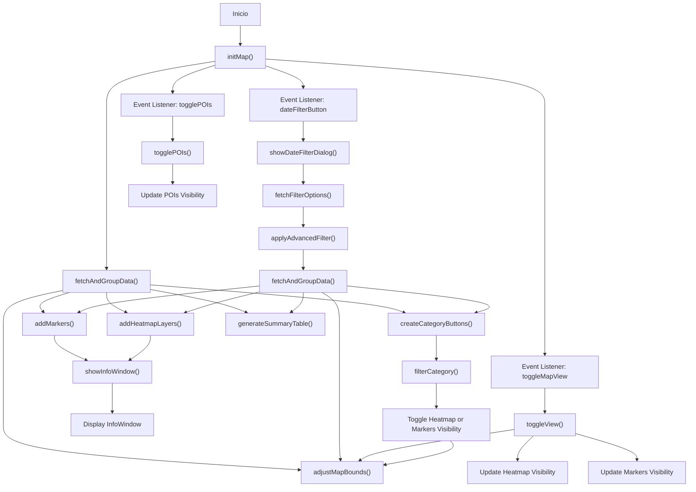
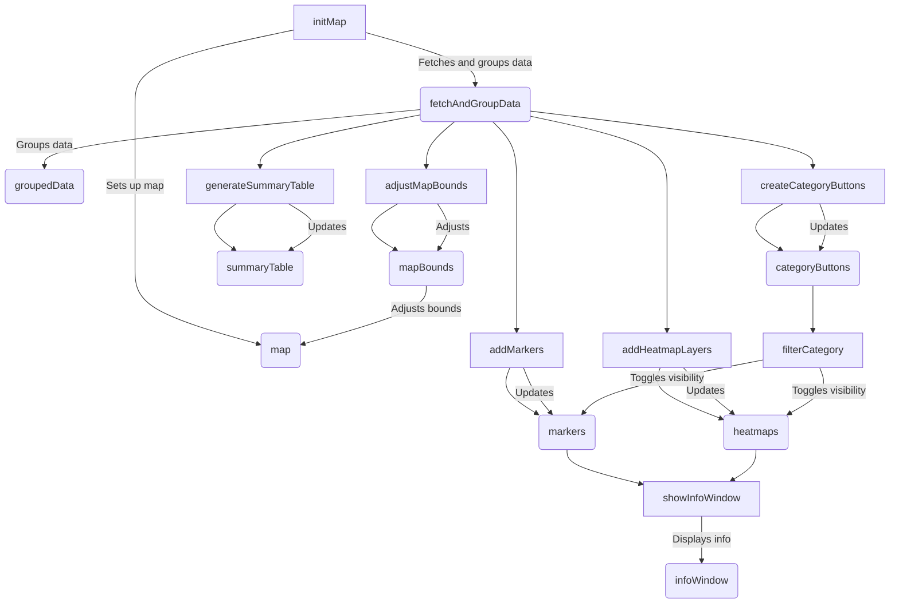

## diagramas
### Diagrama de flujo de funciones de mapa inretactivo

### Diagrama de inretaccion de funciones y variables

## Descripción de Variables

- **`map`**
    - **Tipo**: Objeto
    - **Descripción**: Representa el objeto del mapa donde se mostrarán los datos.
  
- **`heatmaps`**
    - **Tipo**: Objeto
    - **Descripción**: Almacena los mapas de calor creados. Las claves del objeto representan diferentes conjuntos de datos de calor.
  
- **`markers`**
    - **Tipo**: Objeto
    - **Descripción**: Almacena los marcadores colocados en el mapa. Las claves del objeto representan diferentes conjuntos de marcadores.
  
- **`infoWindow`**
    - **Tipo**: Objeto
    - **Descripción**: Representa la ventana de información que se muestra al hacer clic en un marcador en el mapa.
  
- **`currentView`**
    - **Tipo**: Cadena de texto
    - **Descripción**: Indica la vista actual del mapa. Puede ser `'heatmap'` para mostrar el mapa de calor o `'markers'` para mostrar los marcadores.
  
- **`categoryColors`**
    - **Tipo**: Objeto
    - **Descripción**: Almacena los colores asignados a cada categoría para su visualización en el mapa.
  
- **`showPOIs`**
    - **Tipo**: Booleano
    - **Descripción**: Estado que determina si los puntos de interés (POIs) deben mostrarse en el mapa o no.
  
- **`disabledCategories`**
    - **Tipo**: Array de cadenas de texto
    - **Descripción**: Lista de categorías que están desactivadas y, por lo tanto, no se muestran en el mapa.
  
- **`activeCategories`**
    - **Tipo**: Conjunto (Set) de cadenas de texto
    - **Descripción**: Almacena las categorías que están actualmente activas y deben mostrarse en el mapa.
  
- **`bounds`**
    - **Tipo**: Objeto
    - **Descripción**: Almacena los límites geográficos de los puntos en el mapa para ajustar la vista del mapa.
  
- **`originalRowPositions`**
    - **Tipo**: Objeto
    - **Descripción**: Almacena las posiciones originales de las filas para referencia o ajustes en el mapa.

## `initMap()`

Esta función inicializa el mapa de Google Maps y configura su comportamiento y apariencia.

### Detalles

- **Inicializa el Mapa**
    - **Centro**: Coordenadas de Melipilla (`lat: -33.6866`, `lng: -71.2166`).
    - **Zoom**: Nivel de zoom 13.
    - **Estilo**: Configura la visibilidad de los puntos de interés según `showPOIs`.

- **Configura la Ventana de Información**
    - Crea una ventana de información (`infoWindow`) que se muestra al hacer clic en un marcador.

- **Procesa los Datos**
    - Llama a `fetchAndGroupData()` para obtener y agrupar datos.
    - Usa `groupedData` para añadir capas de calor, marcadores, botones de categoría, una tabla resumen y ajustar los límites del mapa.

- **Eventos del Mapa**
    - **`toggleMapView`**: Cambia entre vista de mapa de calor y vista de marcadores.
    - **`togglePOIs`**: Muestra u oculta puntos de interés.
    - **`dateFilterButton`**: Abre un diálogo para filtrar por fecha.

## `showDateFilterDialog()`

Esta función muestra un diálogo para filtrar eventos por fecha, nivel y unidad.

### Descripción

1. **Obtención de Opciones**:
    - Llama a `fetchFilterOptions()` para obtener las opciones de niveles y unidades.
    - Crea opciones `<option>` para los elementos de selección (`<select>`) a partir de los datos obtenidos.

2. **Configuración del Diálogo**:
    - Usa `Swal.fire` para mostrar un diálogo con campos para:
        - **Fecha de Inicio** (`startDate`)
        - **Fecha de Cierre** (`endDate`)
        - **Nivel** (`nivel`), con opciones múltiples
        - **Unidad** (`unidad`), con opciones múltiples

3. **Inicialización y Estilo**:
    - Inicializa `Select2` para los campos de selección (`nivel` y `unidad`), ajustando el tamaño.

4. **Obtención de Datos del Diálogo**:
    - Al confirmar, obtiene las fechas y las selecciones de niveles y unidades.

5. **Aplicación de Filtros**:
    - Llama a `applyAdvancedFilter` con las fechas y selecciones obtenidas.

### Parámetros

- No recibe parámetros directamente.

### Funciones Auxiliares

- **`fetchFilterOptions()`**: Obtiene las opciones para los filtros.
- **`applyAdvancedFilter(startDate, endDate, niveles, unidades)`**: Aplica los filtros seleccionados.

## `fetchFilterOptions()`

Esta función obtiene las opciones de filtros para eventos desde un servidor.

### Descripción

1. **Solicitud de Datos**:
      - Realiza una solicitud `fetch` al endpoint `../../controller/evento.php?op=get_filters_evento_map` para obtener opciones de filtros.

2. **Manejo de Respuesta**:
      - Si la respuesta es correcta (`response.ok`), convierte la respuesta en JSON.
      - Extrae las opciones de `niveles` y `unidades` del JSON, asegurándose de que sean arrays.

3. **Manejo de Errores**:
      - Si ocurre un error durante la solicitud o la conversión de la respuesta, captura el error y lo muestra en la consola.
      - Devuelve arrays vacíos para `niveles` y `unidades` en caso de error.

### Valor de Retorno

- Un objeto con dos propiedades:
      - **`niveles`**: Array de niveles.
      - **`unidades`**: Array de unidades.

## `applyAdvancedFilter(startDate, endDate, niveles, unidades)`

Esta función aplica un filtro avanzado en el mapa basándose en las fechas y selecciones proporcionadas.

### Descripción

1. **Aplicación del Filtro**:
    - Llama a `fetchAndGroupData` con las fechas (`startDate`, `endDate`) y las selecciones (`niveles`, `unidades`) para obtener datos agrupados (`groupedData`).

2. **Actualización del Mapa**:
    - **Limpia Datos del Mapa**: Llama a `clearMapData` para eliminar datos anteriores del mapa.
    - **Añade Capas de Calor**: Usa `addHeatmapLayers` para agregar nuevas capas de calor al mapa.
    - **Añade Marcadores**: Usa `addMarkers` para añadir nuevos marcadores al mapa.
    - **Crea Botones de Categoría**: Usa `createCategoryButtons` para crear botones de selección de categorías.
    - **Restaura Categorías Activas**: Llama a `restoreActiveCategories` para asegurar que las categorías activas se mantengan.
    - **Genera Tabla Resumen**: Usa `generateSummaryTable` para crear una tabla con un resumen de los datos.
    - **Ajusta los Límites del Mapa**: Llama a `adjustMapBounds` para ajustar los límites visibles del mapa según los datos.

### Parámetros

- **`startDate`**: Fecha de inicio para el filtro.
- **`endDate`**: Fecha de cierre para el filtro.
- **`niveles`**: Array de niveles seleccionados.
- **`unidades`**: Array de unidades seleccionadas.

## `addHeatmapLayers(categories)`

Esta función añade capas de calor al mapa para cada categoría de datos proporcionada.

### Descripción

1. **Iteración sobre Categorías**:
    - Recorre cada categoría en el objeto `categories`.

2. **Asignación de Color**:
    - Si la categoría no tiene un color asignado en `categoryColors`, genera un color para ella usando `generateColorFromCategory`.

3. **Creación de Puntos de Calor**:
    - Convierte las coordenadas (`latitud`, `longitud`) de cada ítem en la categoría a objetos `google.maps.LatLng`.

4. **Creación de la Capa de Calor**:
    - Crea una nueva capa de calor (`HeatmapLayer`) para la categoría con los puntos generados.
    - La capa de calor se agrega a `heatmaps` con la categoría como clave.
  
5. **Manejo de Eventos**:
    - **`click`**: Muestra una ventana de información al hacer clic en la capa de calor usando `showInfoWindow`.
    - **`mousemove`**: Muestra una ventana de información al mover el cursor sobre la capa de calor usando `showInfoWindow`.

### Parámetros

- **`categories`**: Objeto donde cada clave es una categoría y cada valor es un array de objetos con `latitud` y `longitud`.

### Funciones Auxiliares

- **`generateColorFromCategory(category)`**: Genera un color para la categoría.
- **`showInfoWindow(latLng, category)`**: Muestra una ventana de información en la ubicación dada.

## `addMarkers(categories)`

Esta función añade marcadores al mapa para cada categoría de datos proporcionada.

### Descripción

1. **Inicialización de Límites**:
    - Crea un objeto `LatLngBounds` (`bounds`) para ajustar los límites visibles del mapa.

2. **Iteración sobre Categorías**:
    - Recorre cada categoría en el objeto `categories`.

3. **Filtro de Categorías Desactivadas**:
    - Omite la categoría si está en la lista `disabledCategories`.

4. **Creación de Marcadores**:
    - Para cada ítem en la categoría:
        - Crea un nuevo marcador (`google.maps.Marker`) con:
            - **Posición**: Coordenadas (`latitud`, `longitud`).
            - **Icono**: Un círculo con color y estilo basados en `categoryColors`.
            - **Título**: Nombre de la categoría del ítem.
        - Añade un **evento de clic** al marcador que muestra una ventana de información usando `showInfoWindow`.
        - **Expande** los límites del mapa para incluir la posición del marcador.

5. **Almacenamiento de Marcadores**:
    - Guarda los marcadores en el objeto `markers`, agrupados por categoría.

### Parámetros

- **`categories`**: Objeto donde cada clave es una categoría y cada valor es un array de objetos con `latitud`, `longitud`, y otros detalles del ítem.

### Funciones Auxiliares

- **`showInfoWindow(latLng, category, detalles, img, unidad, fecha_inicio, fecha_cierre, id)`**: Muestra una ventana de información con los detalles del ítem.

## `showInfoWindow(latLng, category, details = 'Sin detalles', img = '', unidad, fecha_inicio, fecha_cierre, id_evento)`

Esta función muestra una ventana de información en el mapa con detalles sobre un evento.

### Descripción

1. **Construcción del Contenido**:
    - Crea un contenido HTML para la ventana de información con:
      - **ID del Evento** (`id_evento`)
      - **Unidad** (`unidad`)
      - **Categoría** (`category`)
      - **Detalles** (`details`, por defecto `'Sin detalles'`)
      - **Imagen** (`img`, si está disponible, se muestra con un tamaño máximo de 200x150 píxeles)
      - **Fecha de Creación** (`fecha_inicio`)
      - **Fecha de Cierre** (`fecha_cierre`)
      - **Enlace de Seguimiento**: Un botón para más detalles sobre el evento.

2. **Configuración y Apertura de la Ventana**:
    - Usa `infoWindow.setContent(content)` para establecer el contenido HTML.
    - Usa `infoWindow.setPosition(latLng)` para ubicar la ventana en las coordenadas `latLng`.
    - Muestra la ventana de información en el mapa con `infoWindow.open(map)`.

### Parámetros

- **`latLng`**: Coordenadas para la ubicación de la ventana de información.
- **`category`**: Categoría del evento.
- **`details`**: Detalles del evento (opcional, por defecto `'Sin detalles'`).
- **`img`**: Ruta de la imagen del evento (opcional).
- **`unidad`**: Unidad del evento.
- **`fecha_inicio`**: Fecha de creación del evento.
- **`fecha_cierre`**: Fecha de cierre del evento.
- **`id_evento`**: ID del evento para mostrar en el enlace de seguimiento.

## `filterCategory(category, button)`

Esta función ajusta la visibilidad de una categoría en el mapa según la vista actual y el botón proporcionado.

### Descripción

1. **Verificación de Categoría Desactivada**:
    - Si la categoría está en `disabledCategories`, la función no hace nada y termina.

2. **Obtención del Elemento de Fila**:
    - Busca el elemento de fila (`row`) asociado con la categoría en el DOM usando `document.getElementById`.

3. **Guardar Posición Original**:
    - Llama a `saveOriginalRowPosition` para guardar la posición original de la fila para la categoría.

4. **Ajuste de Visibilidad según Vista Actual**:
    - **Vista de Calor (`heatmap`)**:
        - Si la vista actual es `'heatmap'` y existen capas de calor para la categoría, llama a `toggleHeatmapVisibility` para mostrar u ocultar la capa de calor.
    - **Vista de Marcadores (`markers`)**:
        - Si la vista actual es `'markers'` y existen marcadores para la categoría, llama a `toggleMarkersVisibility` para mostrar u ocultar los marcadores.

5. **Ajuste de Límites del Mapa**:
   - Llama a `adjustMapBounds` para actualizar los límites del mapa según la visibilidad actual.

### Parámetros

- **`category`**: Categoría de datos que se desea filtrar.
- **`button`**: Botón que se usa para activar o desactivar la visibilidad de la categoría

## `saveOriginalRowPosition(category, row)`

Esta función guarda la posición original de una fila en una tabla para una categoría específica.

### Descripción

1. **Verificación y Guardado**:
    - Si no se ha guardado previamente la posición para la categoría (`!originalRowPositions[category]`) y la fila (`row`) es válida:
        - Obtiene el elemento `<tbody>` que es el padre de la fila (`row`).
        - Guarda la posición de la fila dentro del `<tbody>` en `originalRowPositions[category]`.

### Parámetros

- **`category`**: Categoría asociada con la fila.
- **`row`**: Elemento de fila (`<tr>`) cuyo índice se desea guardar.

## `toggleHeatmapVisibility(category, button, row)`

Esta función alterna la visibilidad de la capa de calor para una categoría específica y actualiza la interfaz de usuario.

### Descripción

1. **Verificación de Visibilidad**:
    - Obtiene el estado actual de visibilidad de la capa de calor (`isVisible`) usando `heatmaps[category].getMap()`.

2. **Alternancia de Visibilidad**:
    - Si la capa de calor está visible (`isVisible`), la oculta estableciendo su mapa a `null`.
    - Si la capa de calor está oculta, la muestra estableciendo su mapa a `map`.

3. **Actualización de la Interfaz de Usuario**:
    - Llama a `updateUI` para actualizar el estado de la interfaz de usuario según la visibilidad actual.

### Parámetros

- **`category`**: Categoría asociada con la capa de calor.
- **`button`**: Botón que controla la visibilidad de la capa de calor.
- **`row`**: Fila en la tabla asociada con la categoría.

## `toggleMarkersVisibility(category, button, row)`

Esta función alterna la visibilidad de los marcadores para una categoría específica y actualiza la interfaz de usuario.

### Descripción

1. **Verificación de Visibilidad**:
    - Obtiene el estado actual de visibilidad de los marcadores (`areVisible`) usando el primer marcador de la categoría (`markers[category][0].getMap()`).

2. **Alternancia de Visibilidad**:
    - Si los marcadores están visibles (`areVisible`), los oculta estableciendo su mapa a `null`.
    - Si los marcadores están ocultos, los muestra estableciendo su mapa a `map`.

3. **Actualización de la Interfaz de Usuario**:
    - Llama a `updateUI` para actualizar el estado de la interfaz de usuario según la visibilidad actual.

### Parámetros

- **`category`**: Categoría asociada con los marcadores.
- **`button`**: Botón que controla la visibilidad de los marcadores.
- **`row`**: Fila en la tabla asociada con la categoría.

## `updateUI(category, button, row, isVisible)`

Esta función actualiza la interfaz de usuario para reflejar la visibilidad de una categoría en el mapa.

### Descripción

1. **Actualización de Categorías Activas**:
    - Si la categoría está visible (`isVisible` es `true`):
       - Elimina la categoría de `activeCategories`.
       - Elimina la clase `btn-success` del botón (`button`).
       - Si hay una fila (`row`), elimina la clase `table-success` y restaura la posición original de la fila usando `restoreRowPosition`.

    - Si la categoría no está visible (`isVisible` es `false`):
      - Agrega la categoría a `activeCategories`.
      - Añade la clase `btn-success` al botón (`button`).
      - Si hay una fila (`row`), añade la clase `table-success` y mueve la fila al principio usando `moveRowToTop`.

### Parámetros

- **`category`**: Categoría cuya visibilidad se está actualizando.
- **`button`**: Botón asociado con la categoría que se actualiza visualmente.
- **`row`**: Fila en la tabla asociada con la categoría (opcional).
- **`isVisible`**: Estado de visibilidad (`true` si visible, `false` si no visible).

## `fetchAndGroupData(startDate = null, endDate = null, niveles = [], unidades = [])`

Esta función obtiene datos de eventos, los filtra según los parámetros proporcionados, y agrupa los resultados por categoría.

### Descripción

1. **Obtención de Datos**:
    - Realiza una solicitud a la URL especificada para obtener datos de eventos en formato JSON.

2. **Procesamiento de Parámetros**:
    - **`niveles`**: Convierte los niveles a minúsculas.
    - **`unidades`**: Convierte las unidades a minúsculas.

3. **Filtrado de Datos**:
    - **Fecha**: Filtra los eventos por las fechas (`startDate` y `endDate`).
    - **Nivel**: Filtra los eventos que coinciden con alguno de los niveles especificados.
    - **Unidad**: Filtra los eventos que coinciden con alguna de las unidades especificadas.

4. **Agrupación de Datos**:
    - Agrupa los eventos filtrados por la categoría (`categoria`).

5. **Devolución de Resultados**:
    - Retorna un objeto con los datos agrupados por categoría.

### Parámetros

- **`startDate`**: Fecha de inicio para filtrar eventos (opcional).
- **`endDate`**: Fecha de cierre para filtrar eventos (opcional).
- **`niveles`**: Array de niveles para filtrar eventos (opcional).
- **`unidades`**: Array de unidades para filtrar eventos (opcional).

### Manejo de Errores

- Captura y muestra errores de red, retornando un objeto vacío en caso de error.

## `createCategoryButtons(categories)`

Esta función crea botones para cada categoría y los añade al contenedor de controles en la interfaz de usuario.

### Descripción

1. **Inicialización**:
    - Obtiene el contenedor de controles (`controlsDiv`) y limpia su contenido (`innerHTML`).

2. **Creación de Botones por Categoría**:
    - Itera sobre las categorías en el objeto `categories`.

3. **Filtrado de Categorías Desactivadas**:
    - Omite la categoría si está en `disabledCategories`.

4. **Creación de Filas de Botones**:
    - Agrupa los botones en filas (`btn-group`), con hasta 3 botones por fila.

5. **Configuración de Botones**:
    - Crea un botón para cada categoría:
        - **Clase**: `btn btn-outline-primary`.
        - **Texto**: Nombre de la categoría, con la primera letra en mayúscula y espacios añadidos antes de las mayúsculas.
        - **Evento `onclick`**: Llama a `filterCategory` para filtrar la categoría al hacer clic.
        - **Ícono**: Añade un ícono creado con `createCategoryIcon` al botón.

6. **Añadido de Botones al Contenedor**:
   - Añade cada botón a la fila actual (`row`), y después la fila al contenedor de controles (`controlsDiv`).

### Parámetros

- **`categories`**: Objeto donde cada clave es una categoría y cada valor es un array de datos asociados.

### Funciones Auxiliares

- **`createCategoryIcon(color)`**: Crea un ícono para la categoría usando el color especificado.

## `toggleView()`

Esta función alterna entre la vista de calor y la vista de marcadores en el mapa, y actualiza la interfaz de usuario en consecuencia.

### Descripción

1. **Cambio de Vista**:
    - Alterna el valor de `currentView` entre `'heatmap'` y `'markers'`.

2. **Actualización de Capas de Calor**:
    - **Vista de Calor (`heatmap`)**:
        - Muestra las capas de calor para las categorías activas.
    - **Vista de Marcadores (`markers`)**:
        - Oculta las capas de calor.

3. **Actualización de Marcadores**:
    - **Vista de Marcadores (`markers`)**:
      - Muestra los marcadores para las categorías activas.
    - **Vista de Calor (`heatmap`)**:
      - Oculta los marcadores.

4. **Actualización del Botón de Vista**:
    - Cambia el texto del botón de cambio de vista (`toggleMapView`) para reflejar la vista actual:
      - **Vista de Calor**: `'Mapa de Dispersión'` con icono de marcador.
      - **Vista de Marcadores**: `'Mapa de Calor'` con icono de objetivo.

5. **Ajuste de Límites del Mapa**:
    - Llama a `adjustMapBounds` para actualizar los límites del mapa según la visibilidad actual.

### Funciones Auxiliares

- **`adjustMapBounds()`**: Ajusta los límites del mapa para incluir todos los datos visibles.

## `togglePOIs()`

Esta función alterna la visibilidad de los puntos de interés (POIs) en el mapa y actualiza el estado del botón de control.

### Descripción

1. **Alternancia de Visibilidad de POIs**:
    - Cambia el valor de `showPOIs` entre `true` y `false`.

2. **Actualización de Estilos del Mapa**:
    - Ajusta los estilos del mapa para mostrar u ocultar las etiquetas de puntos de interés (`poi`) y puntos de interés comerciales (`poi.business`) según el valor de `showPOIs`.

3. **Actualización del Botón de POIs**:
    - **Cuando `showPOIs` es `true`**:
      - Cambia el texto del botón a `'Ocultar Puntos de Interés'`.
      - Añade el icono `'fa-eye-slash'` al botón.
      - Establece el botón como activo (`btn-active`) y lo elimina de la clase inactiva (`btn-inactive`).

    - **Cuando `showPOIs` es `false`**:
      - Cambia el texto del botón a `'Mostrar Puntos de Interés'`.
      - Añade el icono `'fa-eye'` al botón.
      - Establece el botón como inactivo (`btn-inactive`) y lo elimina de la clase activa (`btn-active`).

4. **Manejo de Errores**:
    - Si el botón con ID `togglePOIs` no se encuentra, muestra un error en la consola.

### Funciones Auxiliares

- **`createIcon(className)`**: Crea un elemento de icono con la clase especificada.

## `createIcon(iconClass)`

Esta función crea un elemento de icono con una clase CSS específica.

### Descripción

1. **Creación del Elemento de Icono**:
   - Crea un nuevo elemento HTML `<i>`.

2. **Asignación de Clases CSS**:
   - Asigna la clase `fas` y la clase proporcionada (`iconClass`) al elemento.
   - Añade la clase `btn-icon` para estilizar el icono.

3. **Devolución del Elemento**:
   - Retorna el elemento `<i>` creado y configurado.

### Parámetros

- **`iconClass`**: Nombre de la clase del icono de FontAwesome (por ejemplo, `'fa-eye'`).

## `generateColorFromCategory(category)`

Esta función genera un color hexadecimal único basado en el nombre de una categoría.

### Descripción

1. **Generación de Hash**:
    - Inicializa una variable `hash` en 0.
    - Recorre cada carácter en el nombre de la categoría (`category`) y actualiza el `hash` utilizando el código de carácter (`charCodeAt`) y operaciones bit a bit.

2. **Conversión del Hash a Color**:
    - Inicia una cadena con `'#'` para el color hexadecimal.
    - Extrae y convierte tres valores de 8 bits del `hash` a su representación hexadecimal.
    - Asegura que cada valor tenga dos dígitos utilizando `slice(-2)`.

3. **Devolución del Color**:
    - Retorna la cadena de color hexadecimal generada.

### Parámetros

- **`category`**: Nombre de la categoría (cadena de texto) a partir del cual se genera el color.

## `applyDateFilter(startDate, endDate)`

Esta función aplica un filtro de fechas y actualiza los datos en el mapa en función de dicho filtro.

### Descripción

1. **Obtención y Agrupación de Datos**:
    - Llama a `fetchAndGroupData` con las fechas de inicio (`startDate`) y fin (`endDate`) para obtener los datos filtrados y agrupados.

2. **Limpieza de Datos en el Mapa**:
    - Llama a `clearMapData` para eliminar los datos actuales del mapa.

3. **Adición de Nuevas Capas y Marcadores**:
    - Añade nuevas capas de mapa de calor (`addHeatmapLayers`) y marcadores (`addMarkers`) basados en los datos filtrados.

4. **Creación de Botones de Categoría**:
    - Genera botones para cada categoría utilizando `createCategoryButtons`.

5. **Restauración y Ajuste**:
    - Llama a `restoreActiveCategories` para restaurar las categorías activas.
    - Ajusta los límites del mapa para incluir todos los datos visibles con `adjustMapBounds`.

### Parámetros

- **`startDate`**: Fecha de inicio del filtro (cadena de texto en formato de fecha).
- **`endDate`**: Fecha de fin del filtro (cadena de texto en formato de fecha).

## `clearMapData()`

Esta función elimina todos los datos visuales del mapa, incluyendo las capas de calor y los marcadores.

### Descripción

1. **Eliminación de Capas de Calor**:
    - Recorre todas las claves en el objeto `heatmaps`.
    - Desactiva cada capa de calor en el mapa llamando a `setMap(null)` para cada categoría.

2. **Eliminación de Marcadores**:
    - Recorre todas las claves en el objeto `markers`.
    - Desactiva todos los marcadores en el mapa para cada categoría, utilizando `setMap(null)`.

### Parámetros

- **Ninguno**: Esta función no recibe parámetros.

## `restoreActiveCategories()`

Esta función restaura la visibilidad de las categorías activas en el mapa, ya sea mostrando las capas de calor o los marcadores, según la vista actual.

### Descripción

1. **Recorrido de Categorías Activas**:
    - Recorre todas las categorías almacenadas en `activeCategories`.

2. **Restauración de Capas de Calor**:
    - Si la vista actual (`currentView`) es `heatmap` y existe una capa de calor para la categoría, se muestra la capa en el mapa.

3. **Restauración de Marcadores**:
    - Si la vista actual es `markers` y existen marcadores para la categoría, se muestran los marcadores en el mapa.

### Parámetros

- **Ninguno**: Esta función no recibe parámetros.

## `adjustMapBounds()`

Esta función ajusta los límites del mapa para asegurarse de que todos los marcadores activos sean visibles.

### Descripción

1. **Recopilación de Marcadores Activos**:
    - Recorre las categorías en `activeCategories`.
    - Agrega los marcadores activos de cada categoría a un array `activeMarkers`.

2. **Ajuste de los Límites del Mapa**:
    - Si hay marcadores activos, se crea un nuevo límite (`newBounds`) que se expande para incluir la posición de cada marcador.
    - El mapa ajusta su vista para encajar dentro de estos límites utilizando `map.fitBounds(newBounds)`.

3. **Ajuste por Defecto**:
    - Si no hay marcadores activos, se ajusta el mapa a los límites almacenados previamente en `bounds`, siempre que estos existan y no estén vacíos.

### Parámetros

- **Ninguno**: Esta función no recibe parámetros.

## `createCategoryIcon(color)`

Esta función crea un ícono de círculo coloreado para representar una categoría en la interfaz.

### Descripción

1. **Creación del Ícono**:
    - Se crea un elemento `i` utilizando `document.createElement('i')`.

2. **Asignación de Clases y Estilo**:
    - Se asigna la clase `fa fa-circle` al ícono para darle la forma de un círculo utilizando FontAwesome.
    - Se ajusta el color del ícono mediante `icon.style.color = color`.
    - Se añade un margen derecho de 5 píxeles al ícono para separarlo visualmente de otros elementos.

3. **Retorno del Ícono**:
    - La función devuelve el elemento ícono listo para ser utilizado en la interfaz.

### Parámetros

- **color** (`string`): El color hexadecimal que se aplicará al ícono.

## `generateSummaryTable(groupedData)`

Genera una tabla resumen que muestra estadísticas de los eventos agrupados por categoría.

### Descripción

1. **Preparación del Contenedor**:
    - Selecciona el contenedor de la tabla (`summaryTableContainer`) y limpia cualquier contenido previo.

2. **Creación de la Tabla**:
    - Crea una tabla con clases Bootstrap y define los encabezados de las columnas, que incluyen:
      - N°
      - Categoría
      - Cantidad de Eventos
      - Cantidad de Eventos por Nivel
      - Cantidad de Eventos Abiertos
      - Cantidad de Eventos Cerrados
      - Primer Día de Inicio
      - Último Día de Inicio
      - Primer Día de Cierre
      - Último Día de Cierre

3. **Población de Datos**:
    - Para cada categoría en `groupedData`:
      - Calcula las fechas de inicio más tempranas y tardías.
      - Filtra y cuenta eventos cerrados y abiertos.
      - Cuenta los eventos por nivel y crea etiquetas Bootstrap para mostrarlos.
      - Crea una fila en la tabla con los datos calculados.

4. **Inserción en el DOM**:
    - Agrega la tabla generada al contenedor `summaryTableContainer`.

### Parámetros

- **groupedData** (`Object`): Datos de eventos agrupados por categoría.

## `formatDate(date, fallbackText = 'Fecha no disponible')`

Formatea una fecha en formato `YYYY-MM-DD`. Si la fecha es inválida, devuelve un texto alternativo.

### Descripción

- **Verificación de Fecha**: Si la fecha es inválida o no está definida, devuelve `fallbackText`.
- **Formato de Fecha**: Si la fecha es válida, se devuelve en formato `YYYY-MM-DD`.

### Parámetros

- **date** (`Date`): La fecha a formatear.
- **fallbackText** (`string`): Texto a mostrar si la fecha no es válida (opcional).

### Retorno

- **string**: La fecha formateada o el texto alternativo.

---

## `getRowNumber(row)`

Obtiene el número de fila de una fila de la tabla.

### Descripción

- **Extracción del Número**: Lee el texto del primer celda de la fila y lo convierte a un número entero.

### Parámetros

- **row** (`HTMLElement`): El elemento de la fila de la tabla.

### Retorno

- **number**: El número de la fila.

---

## `restoreRowPosition(row)`

Restaura la posición original de una fila en la tabla.

### Descripción

- **Identificación de Posición**: Utiliza el número de fila para determinar la posición original en el `tbody`.
- **Inserción de Fila**: Inserta la fila en la posición correcta o al final si no hay una fila de destino.

### Parámetros

- **row** (`HTMLElement`): La fila que se debe mover a su posición original.

---

## `restoreOriginalOrder()`

Restaura el orden original de las filas en la tabla según sus posiciones guardadas.

### Descripción

- **Ordenación de Filas**: Ordena las filas según las posiciones originales guardadas.
- **Reordenamiento**: Añade las filas ordenadas al `tbody`.

### Parámetros

- Ninguno.

### Retorno

- Ninguno.

---

## `moveRowToTop(row)`

Mueve una fila al principio del `tbody`.

### Descripción

- **Inserción en el Inicio**: Mueve la fila al principio del `tbody`.

### Parámetros

- **row** (`HTMLElement`): La fila que se debe mover al principio del `tbody`.

### Retorno

- Ninguno.
